# SavedIn - LinkedIn Posts Manager

A modern web application for saving and organizing LinkedIn posts, built with React and Tailwind CSS.

🔗 [Live Demo](https://savedin-mo3bassias-projects.vercel.app)

## 🌟 Features

- **Post Management**
  - Save posts with title, description, and links
  - Flexible tagging system
  - Reading status tracking
  - Notes and comments support

- **Rich User Interface**
  - Full Arabic/English support
  - Dark/Light mode
  - Smooth animations
  - Responsive design

- **Analytics**
  - Detailed statistics
  - Visual charts and graphs
  - Reading progress tracking
  - Tag usage analysis

- **Data Management**
  - Local storage
  - Backup/Restore functionality
  - Data export/import
  - JSON format support

## 📱 Screenshots

### 1. Arabic Landing Page
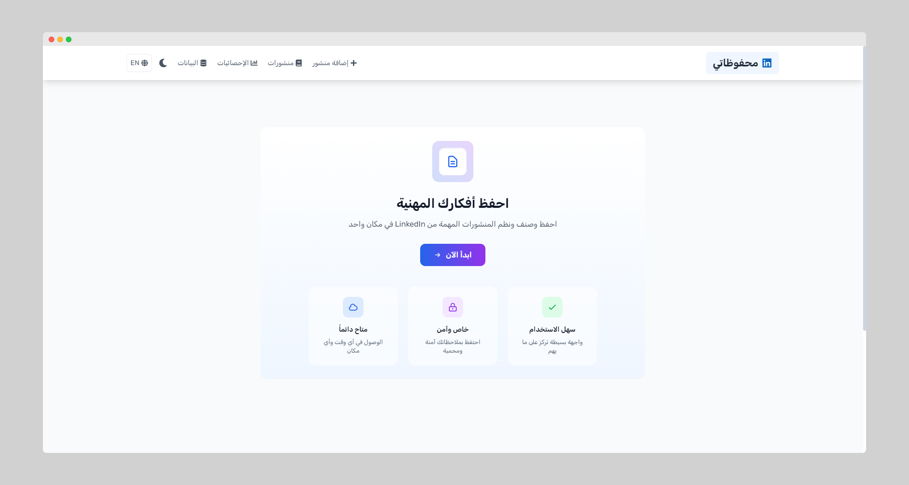
*Landing page in Arabic with feature highlights and quick navigation*

### 2. English Landing Page
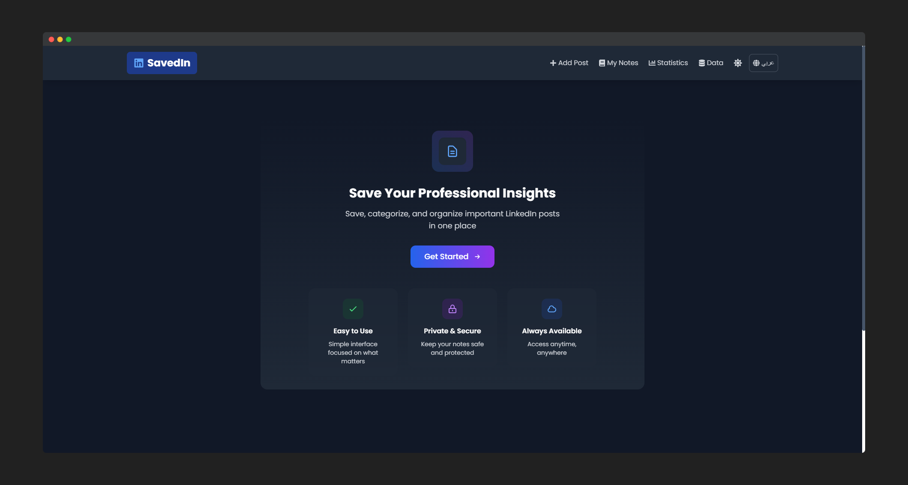
*Landing page in English showcasing the app's multilingual support*

### 3. Statistics Dashboard (Arabic)
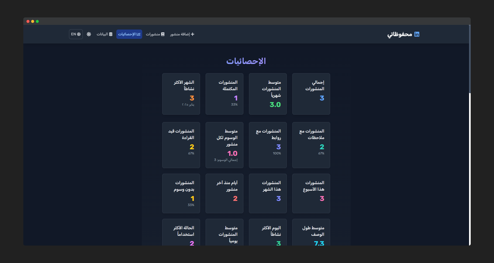
*Comprehensive analytics dashboard showing post metrics and activity*

### 4. Notes List with Search
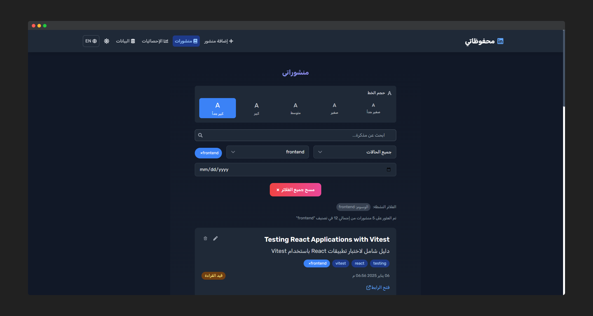
*Main notes page with search, filter, and tag management*

### 5. Notes List with Tag Filter
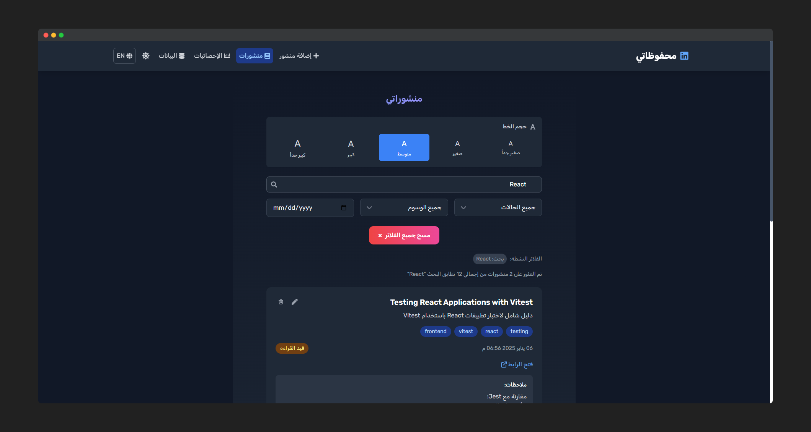
*Advanced tag filtering and post organization*

### 6. Post Details View
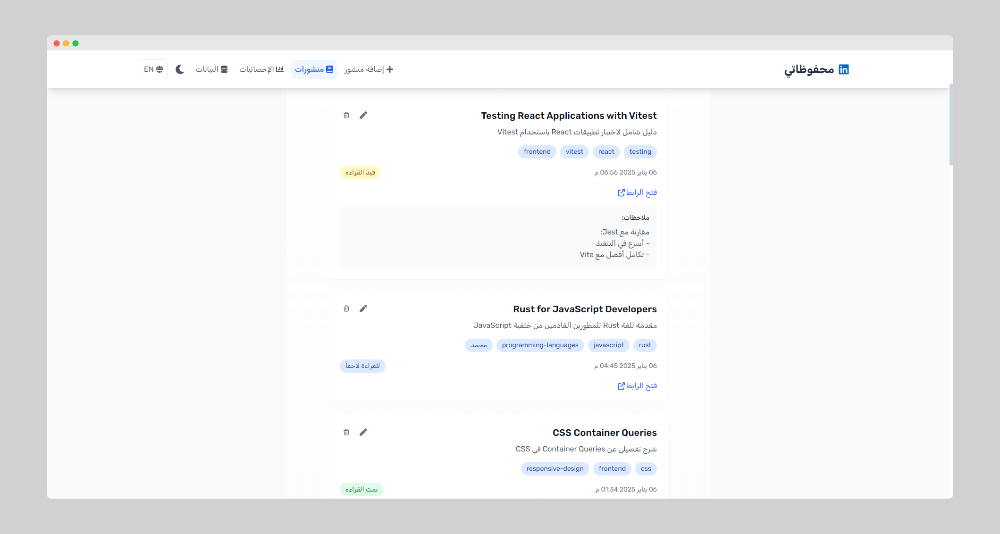
*Detailed view of a saved post with notes and metadata*

### 7. Multiple Posts View
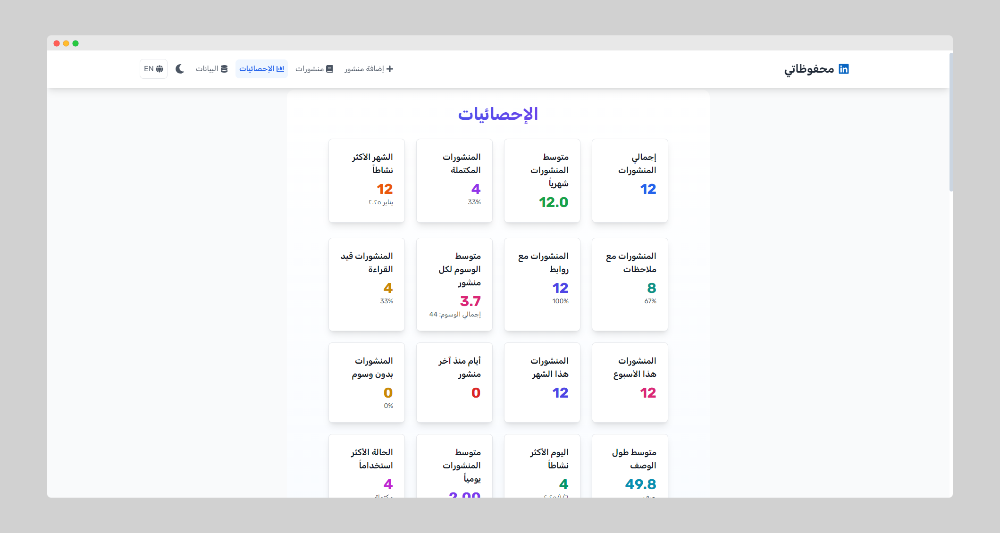
*List view showing multiple saved posts with their tags*

### 8. Analytics Charts
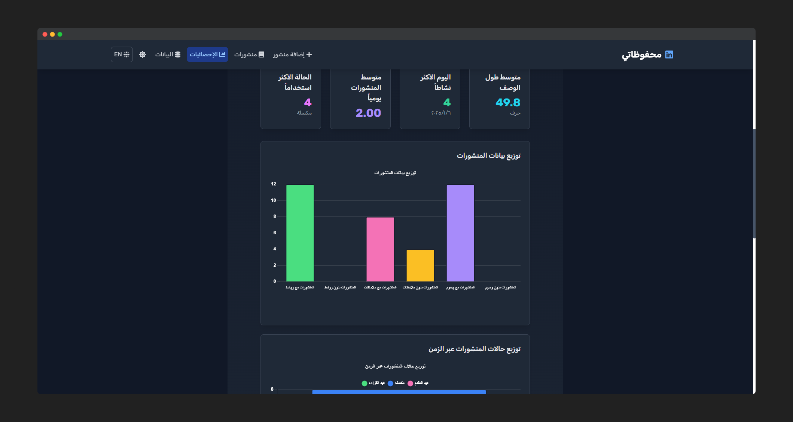
*Visual analytics with charts showing post distribution*

### 9. Data Management
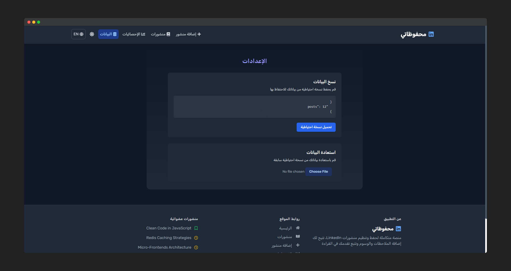
*Backup and restore functionality for data management*

### 10. Add New Post
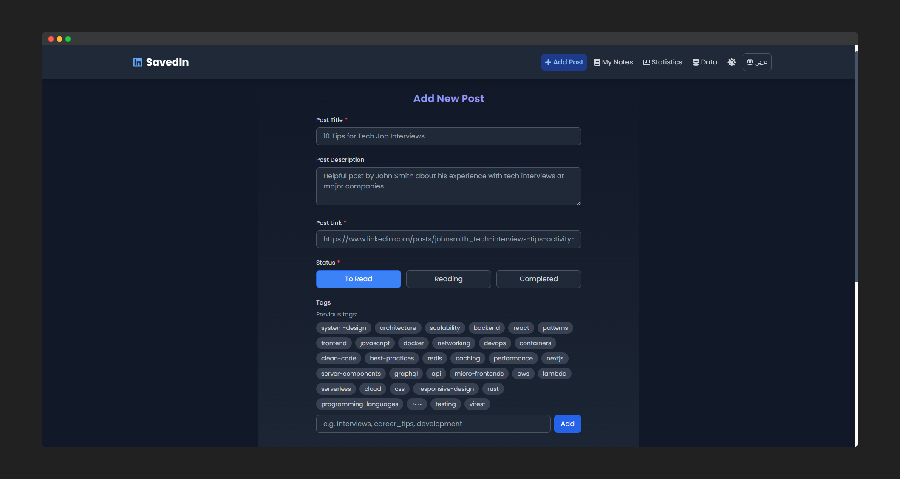
*Form for adding new posts with title, description, and tags*

### 11. Post Tags Selection
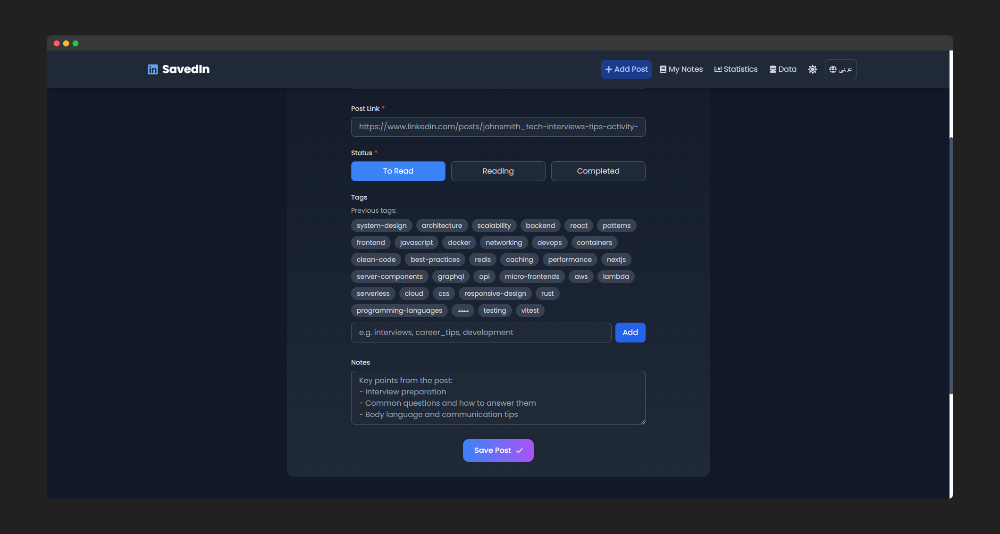
*Rich tag selection interface with previously used tags*

## 🚀 Getting Started

1. Clone the repository:
```bash
git clone https://github.com/Mo3bassia/savedin.git
```

2. Install dependencies:
```bash
cd savedin
npm install
```

3. Run the development server:
```bash
npm start
```

## 🛠️ Built With

- React
- Tailwind CSS
- Chart.js
- GSAP
- React Router
- React Toastify
- date-fns

## 🤝 Contributing

Contributions are welcome! Please feel free to submit a Pull Request.

## 📝 License

This project is licensed under the MIT License - see the [LICENSE](LICENSE) file for details.

## 🙏 Acknowledgments

- Built with Windsurf Codeium
- Inspired by the LinkedIn community
- Thanks to all contributors
